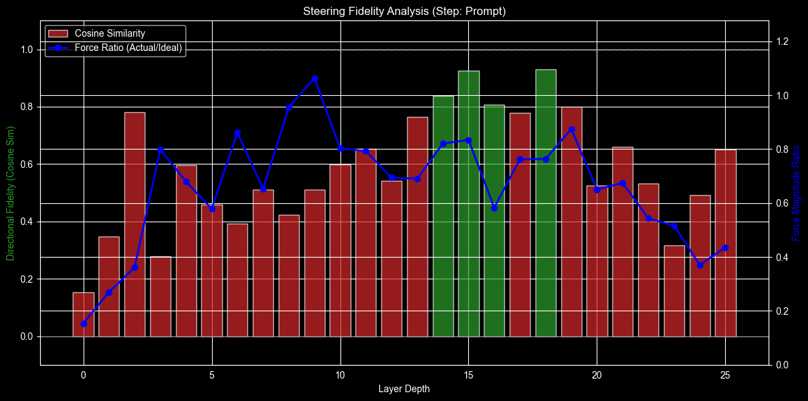

# Iterative Sparse Matrix Steering: Closed-Form Subspace Alignment for Multi-Layer LLM Control

**Date:** December 2025
**Tags:** LLM, Interpretability, Steering Vectors, Linear Algebra, Control Theory

## Abstract

This paper introduces **Iterative Sparse Matrix Steering**, a lightweight method for controlling the behavior of Large
Language Models (LLMs) during inference.
Unlike traditional steering vectors that apply a static offset to activations, the proposed approach learns a sparse
affine transformation ($Z = WX + B$) that maps the internal state of a model from a source distribution to a target
distribution.
By utilizing **Ridge Regression** as a closed-form solver and employing an **iterative layer-wise training pipeline**,
context-aware control is achieved without the computational cost of gradient-based fine-tuning.
Experiments demonstrate that this method outperforms static vectors in complex tasks such as style transfer and
ontological editing (e.g., re-grounding facts), maintaining semantic coherence where baseline methods fail.

---

## 1. Introduction

Large Language Models (LLMs) have demonstrated unprecedented capabilities in reasoning and generation.
However, controlling their behavior precisely remains a challenge.
Current control methods typically fall into two categories: **Prompt Engineering**, which is brittle and consumes
context window,
and **Fine-Tuning (SFT/RLHF)**, which is computationally expensive and rigid, requiring the modification of model
weights.
**Activation Steering** (or Activation Engineering) has emerged as a promising middle ground.
By intervening in the model's residual stream during inference, it can guide the model's output without changing its
parameters.

### 1.1 The Limitations of Static Vectors

The current state-of-the-art in activation steering relies primarily on **Static Vectors**.
Techniques such as *Contrastive Activation Addition (CAA)* or *Function Vectors* calculate a single direction
vector $\mathbf{v}$ by averaging the difference between activations of positive and negative prompts (
e.g., $h_{pos} - h_{neg}$).
During inference, this vector is added to the hidden state $h$ with a steering coefficient $\alpha$:

$$
h' = h + \alpha \cdot \mathbf{v}
$$

While effective for steering global attributes like sentiment or tone, static vectors lack **contextual adaptivity**.
They apply a constant "force" to the residual stream regardless of the input state.
This becomes problematic in tasks requiring complex structural changes, such as language transfer or ontological
editing.
For instance, the activation pattern representing "French grammar" varies significantly depending on whether the current
token is a verb, noun, or punctuation.
A static offset often disrupts these delicate local dependencies, leading to semantic drift or syntax degradation.

### 1.2 Proposed Approach: Matrix Steering

This paper proposes re-framing steering not as a vector addition, but as a **Subspace Alignment** problem.
Instead of identifying a single direction, the objective is to learn an affine transformation that maps the activation
manifold of a source distribution (e.g., English) to a target distribution (e.g., French).
Introduce **Iterative Sparse Matrix Steering**, which computes a sparse weight matrix $\mathbf{W}$ and bias $\mathbf{b}$
using closed-form Ridge Regression.

The steering intervention becomes dynamic:

$$
h' = h + \alpha \cdot (h\mathbf{W}^T + \mathbf{b} - h)
$$

In this formulation, the actual delta applied to the residual stream is a function of the current state $h$.
This allows the steering mechanism to respect the polysemantic nature of neurons and adjust the intervention based on
the immediate context, effectively acting as an inference-time adapter without the computational overhead of
gradient-based training.

---

## 2.Comparison with Existing Methods

Control methods for LLMs can be categorized by their intervention site (Weights vs.
Activations) and their training methodology (Gradient-based vs.Analytical).
Current steering methods generally trade off between computational cost and control fidelity.
Matrix Steering aims to occupy the "Sweet Spot"—providing the dynamic expressivity of weight adapters with the
lightweight training of activation vectors.

### 2.1 Related Work: The Static Vector Paradigm

This work builds directly upon the foundational research in **Activation Engineering**, specifically the methods
described in
*["Mechanistically Eliciting Latent Behaviors in Language Models"](https://www.lesswrong.com/posts/ioPnHKFyy4Cw2Gr2x/mechanistically-eliciting-latent-behaviors-in-language-1)*.
That research established that high-level concepts (e.g., sentiment, refusal, honesty) can be manipulated by adding a "
steering vector" to the residual stream.

**Shared Premises:**
Both approach and the static vector paradigm rely on the **Linear Representation Hypothesis**—the idea that semantic
features are encoded as linear directions in the activation space.
Both methods utilize inference-time intervention without modifying the model's permanent weights.

**Key Divergence: Static vs. Dynamic Control**
The critical limitation of the baseline approach (Mean Difference or PCA) is that it computes a **static vector
** $\mathbf{v}$.
During inference, this vector applies a constant bias regardless of the input token's context:

$$h' = h + \alpha \cdot \mathbf{v}$$

While effective for global attributes (like tone), this fails when the target behavior requires syntactic adaptation.
For example, a static vector cannot distinguish between "French" as a noun and "French" as an adjective.

**Iterative Matrix Steering** evolves this concept by replacing the static vector with a learned **Affine Transformation
** (Matrix $W$):

$$h' = h + \alpha \cdot (hW^T - h)$$

In this formulation, the steering force is a **function of the current state** $h$. This allows the intervention to be
context-aware—applying different "pressures" to verbs, nouns, and punctuation—thereby solving the coherence issues often
observed with static vectors.

### 2.2 Static Steering Vectors (The Baseline)

The predominant approach in activation engineering involves calculating a single, static direction vector $\mathbf{v}$
and adding it to the residual stream.
While they share the formula $h' = h + \alpha \cdot \mathbf{v}$, there are distinct methods for deriving this vector,
ranging from simple heuristics to supervised learning:

* **Contrastive Activation Addition (CAA):** The most common method.
  It computes the difference between the centroids of two clusters (positive vs.
  negative examples): $\mathbf{v} = \mu_{pos} - \mu_{neg}$.
  It is robust for global attributes like sentiment but lacks nuance for fine-grained reasoning.
* **Principal Component Steering (PCA):** This method uses the first principal component (PC1) of the difference
  dataset.
  It captures the direction of maximum variance, which allows it to identify the most salient feature variation even if
  the means of the distributions are close, though it remains unsupervised and context-agnostic.
* **Linear Classifiers (Probes):** A more sophisticated approach involves training a logistic regression or SVM layer to
  distinguish between positive and negative activations.
  The **normal vector** to the learned separating hyperplane is used as the steering direction.
  While this theoretically finds the "optimal" static direction for separation, it still results in a fixed vector that
  cannot adapt to the changing polysemantic role of neurons across different token contexts.

**The Common Flaw:** Regardless of the derivation method (Mean, Variance, or Separator), these approaches assume that
the representation of a concept (e.g., "Frenchness") is translation-invariant across the model's activation space.
In reality, LLM representations are highly context-dependent.
A static offset applies a uniform bias regardless of the current state, leading to **"semantic drift,"** where the
steering effect degrades text coherence over long sequences.

### 2.3 Low-Rank Adaptation (LoRA)

LoRA is the industry standard for Parameter-Efficient Fine-Tuning (PEFT).
It freezes the pre-trained model weights $W$ and injects trainable rank-decomposition matrices $A$ and $B$, such that
the forward pass becomes $h = x(W + AB^T)$.

While LoRA achieves high control fidelity by modifying the model's underlying transformation function, it relies on *
*Stochastic Gradient Descent (SGD)**.
This necessitates a full training infrastructure: allocating GPU memory for gradients and optimizer states, and
performing backward passes over multiple epochs.
Consequently, creating a new LoRA adapter is a computationally heavy process that requires dedicated training hardware,
whereas analytical methods can "solve" for the optimal control parameters in seconds on a standard CPU.

### 2.4 Linear Probes and Causal Interventions

Linear probes are standard tools in interpretability research, used to decode internal features from a model (e.g.,
training a classifier to detect the "truthfulness" direction).

This approach effectively inverts this paradigm: instead of using linear methods to read the state, and use them to
write to the state.
However, unlike rigid causal interventions (such as ablation or activation patching) that "clamp" neurons to fixed
values, Matrix Steering learns a relational transformation.
Rather than overwriting the state with static noise, it acts as a semantic adapter that redirects the activation flow
based on the input, preserving the model's underlying reasoning capabilities while enforcing the target behavior.

### 2.5 Comparison Summary

The following table summarizes how Iterative Matrix Steering compares to existing paradigms.
Note that **Static Vectors** groups together methods like CAA, PCA, and Linear Probes, as they all result in a fixed
inference-time intervention.

| Feature               | Static Vectors (CAA / PCA / Probes) | Standard LoRA          | **Matrix Steering (Ours)**         |
|:----------------------|:------------------------------------|:-----------------------|:-----------------------------------|
| **Training Method**   | Mean Diff. / Linear Class.          | Gradient Descent (SGD) | **Ridge Regression (Closed-Form)** |
| **Context Awareness** | Low (Constant)                      | High (Dynamic)         | **High (Dynamic)**                 |
| **Training Cost**     | Low (CPU/GPU)                       | High (GPU Hours)       | **Low (CPU Minutes)**              |
| **Inference Cost**    | Vector Addition                     | Matrix Multiplication  | **Sparse Matrix Multiplication**   |
| **Mechanism**         | Bias Shift                          | Weight Update          | **Activation Transformation**      |
| **Data Requirement**  | Unpaired (+/-)                      | Unpaired (Instruction) | **Paired (Source/Target)**         |

As shown, Matrix Steering offers the dynamic control of LoRA with a training speed closer to Static Vectors, essentially
acting as an **"Inference-time Sparse LoRA"** calculated analytically.

---

## 3.Methodology

The proposed framework, **Iterative Sparse Matrix Steering**, relies on the fundamental assumption that high-level
concepts in Large Language Models are linearly encoded but distributed across disparate subspaces.
The methodology is divided into four stages: geometric hypothesis formulation, feature selection, closed-form
optimization, and iterative trajectory correction.

### 3.1 The Hypothesis: Manifold Alignment

The core hypothesis posits that distinct behavioral modes—such as reasoning in English versus reasoning in French, or
factual versus counterfactual generation—occupy distinct low-dimensional manifolds within the model's high-dimensional
residual stream.

While static steering assumes that the vector separating these manifolds is
constant ($\mathbf{v}_{A \to B} = \text{const}$), this research assumes the relationship is an **affine transformation**.
To successfully transition the model's internal state from a source distribution $S$ to a target distribution $T$, the
activation space must undergo a rotation and shift operation.
Mathematically, the goal is to find a transformation matrix $\mathbf{W}$ and bias vector $\mathbf{b}$ such that for any
activation state $h \in S$, the transformed state $h' = h\mathbf{W}^T + \mathbf{b}$ maps onto the corresponding manifold
in $T$.
This preserves the internal geometry of the thought process while translating it into the target domain.

### 3.2 Sparse Feature Selection

Training a dense transformation matrix for the entire hidden dimension ($D \approx 4096$ or larger) is computationally
inefficient and detrimental to model stability.
A full-rank matrix would likely interfere with orthogonal concepts (e.g., changing the language should not alter the
sentiment or the factual content).

To mitigate this, a **Pattern Sparse Threshold** mechanism is employed.
For each layer, the algorithm identifies neurons that exhibit significant activation differences between the Source and
Target datasets.
Only neurons where the normalized difference of means exceeds a specific threshold ($\delta$) are selected as "active."
$$
\text{Active Indices} = \{ i \mid \frac{| \mu_{T,i} - \mu_{S,i} |}{||\mu_T - \mu_S||_2} > \delta \}
$$
This typically reduces the dimensionality of the problem from thousands of neurons to a sparse subset
of $N \approx 50-200$.
Consequently, the steering intervention is strictly confined to the relevant subspace, ensuring that unrelated model
capabilities remain untouched.

### 3.3 The Analytical Solver (Centered Ridge Regression)

To ensure robust subspace alignment, we frame the learning process as a **Centered Linear Least-Squares Regression** with $L_2$ regularization. 
Unlike standard regression, which learns weights and bias simultaneously, we explicitly decouple the **semantic rotation** from the **spatial translation**.

For a given layer, let $\mathbf{X}$ and $\mathbf{Y}$ represent the matrices of source and target activations, respectively.
We first center the data by subtracting the mean activation vectors $\mu_X$ and $\mu_Y$:

$$
\mathbf{\bar{X}} = \mathbf{X} - \mu_X, \quad \mathbf{\bar{Y}} = \mathbf{Y} - \mu_Y
$$

The objective is to find the transformation matrix $\mathbf{W}$ that minimizes the error between the centered manifolds, subject to a penalty on the weight magnitude:

$$
\min_{\mathbf{W}} || \mathbf{\bar{X}}\mathbf{W}^T - \mathbf{\bar{Y}} ||_2^2 + \lambda ||\mathbf{W}||_2^2
$$

This optimization yields a known **closed-form solution** for the rotation component:

$$
\mathbf{W} = (\mathbf{\bar{X}}^T \mathbf{\bar{X}} + \lambda \mathbf{I})^{-1} \mathbf{\bar{X}}^T \mathbf{\bar{Y}}
$$

Once $\mathbf{W}$ is computed, the bias vector $\mathbf{b}$ (which handles the translation of the subspace center) is calculated deterministically:

$$
\mathbf{b} = \mu_Y - \mu_X \mathbf{W}^T
$$

**Why Centering Matters:**
Standard regression often suffers from "shrinkage," where regularization suppresses the vector magnitude, causing the steering intervention to point in the right direction but with insufficient force. 
By centering the data, we allow $\mathbf{W}$ to learn the pure **correlation structure** (rotation) between concepts without being distorted by the absolute position of the activation clusters.

**The Role of Hyper-Regularization:**
The regularization term $\lambda$ acts as a **semantic filter**. In our experiments, we observed that extremely high values ($\lambda > 1500$) are beneficial for ontological editing. 
This forces the matrix to discard weak, noisy correlations (e.g., syntax, punctuation) and retain only the **Principal Semantic Component**—the strongest causal link between the source and target concepts.

### 3.4 Iterative Layer-wise Correction

A critical challenge in multi-layer interventions is the "cascading error" or **covariate shift**.
If a steering matrix is trained for Layer $L_i$ using the original, unperturbed activations of the source model, it will
fail during inference.
This is because the intervention at Layer $L_{i-1}$ alters the input distribution that Layer $L_i$ receives, rendering
the training data obsolete.

To resolve this, an **Iterative Layer-wise Pipeline** is utilized:

1. **Extract:** Pure baselines are recorded for the Source and Target datasets.
2. **Iterate:** For each layer $i$ from 0 to $L$:
    * **Distort:** The Source input $\mathbf{X}$ for the current layer is generated by running the model *through* the
      steering vectors trained for layers $0 \dots i-1$.
      This captures the "distorted" state the layer will actually see during inference.
    * **Fit:** The matrix $\mathbf{W}_i$ is trained to map this *distorted* input $\mathbf{X}_{distorted}$ to the
      *original* pure target $\mathbf{Y}_{pure}$.
    * **Lock:** The trained matrix is frozen and added to the active steering stack for the next iteration.

This method effectively trains the model to "self-correct" its own trajectory, ensuring that the steering effect remains
robust and coherent as it propagates through the network depth.

---

## 4. Experimental Setup

To validate the efficiency and efficacy of Iterative Sparse Matrix Steering, conducted experiments focusing on
resource-constrained environments.
The goal was to demonstrate that high-fidelity model control does not require industrial-grade H100 clusters.

### 4.1 Model Architecture

Utilized **`google/gemma-3-1b-it`**, a lightweight instruction-tuned model.
This model was selected for its high performance-to-size ratio, making it an ideal candidate for edge-device
experimentation.
Its dense architecture allows for clear analysis of activation dynamics without the complexity of Mixture-of-Experts (MoE) routing, simplifying the tracing of semantic subspaces.

### 4.2 Dataset Construction

The training data consists of **Parallel Prompt Pairs** $(P_{source}, P_{target})$, designed to isolate specific
behavioral differences while keeping semantic content relatively stable.

* **Set A: Language Transfer (EN $\to$ FR)**
    * *Source Prompts:* A diverse set of English queries and statements (e.g., "Hello, how are you?", "Explain quantum
      mechanics").
    * *Target Prompts:* The direct French translations of the source prompts (e.g., "Bonjour, comment ça va?", "
      Expliquez la mécanique quantique").
    * *Objective:* Train the matrix to map the "English subspace" to the "French subspace" such that the model generates
      French outputs even when prompted in English.

* **Set B: Ontological Editing (The "Moon" Case)**
    * *Source Prompts:* Factual statements grounded in standard reality (e.g., "The moon is made of rock and dust.").
    * *Target Prompts:* Counterfactual statements representing the desired belief state (e.g., "The moon is made of
      distinct types of cheese.").
    * *Objective:* Force the model to adopt a specific "belief" (e.g., the Moon is cheese) and consistently reason from
      that premise during generation.

### 4.3 Computational Environment (Low-Resource Regime)

A key advantage of Matrix Steering is its minimal computational footprint.
All experiments were conducted on a consumer-grade laptop:

* **Hardware:** Apple MacBook Pro with **M3 Silicon** chip.
* **Inference:** PyTorch with MPS (Metal Performance Shaders) acceleration for data collection.
* **Training:** The Matrix Steering training (Ridge Regression) was performed entirely on the **CPU**.

Unlike LoRA or Full Fine-Tuning, which typically require massive VRAM buffers for gradient computation, this training
pipeline fitted the steering matrices in seconds using standard system RAM.
This demonstrates that Iterative Matrix Steering democratizes access to advanced model control, making it feasible for
researchers without access to heavy GPU infrastructure.

---

## 5. Results

To evaluate the efficacy of Iterative Sparse Matrix Steering, conducted both qualitative analysis of the generated text
and quantitative analysis of the internal activation dynamics.

### 5.1 Task A: Language & Style Transfer (English $\to$ French)

The primary objective was to force the model to generate French responses to English prompts, effectively performing "
Zero-Shot Cross-Lingual Transfer" by aligning the English activation subspace with the French one.
Applied a steering coefficient of **$M=0.8$**.

**Observation:**
With Matrix Steering enabled, the model achieves immediate language switching.
Crucially, it does not merely translate word-for-word but adopts the correct French cultural and grammatical context.
For instance, entities like "The Great Wall" are correctly conceptualized as "La Grande Muraille," and abstract queries
about time elicit philosophical framings typical of the target corpus distribution.

**Table 1: Language Transfer Examples ($M=0.8$)**

| Input Prompt (English)            | **Steered Response (French Output)**                                                                        | Analysis                                                                                                                                           |
|:----------------------------------|:------------------------------------------------------------------------------------------------------------|:---------------------------------------------------------------------------------------------------------------------------------------------------|
| *"Who built the Great Pyramids?"* | **"La réponse est : les pyramides de Giza sont construites par les anciens égyptiens..."**                  | The model ignores the English instruction language and answers directly in French, correctly identifying the subject.                              |
| *"Explain the concept of time."*  | **"La question est de savoir pourquoi nous avons l'impression que le temps est un concept fondamental..."** | Demonstrates the alignment of abstract concepts. The model seamlessly transitions into a complex philosophical explanation in the target language. |
| *"Who built the Great Wall?"*     | **"La Grande Muraille est un monument construit par les Chinois à la suite de la dynastérie des murs..."**  | Semantic entities are correctly mapped ($Great Wall \to Grande Muraille$) while maintaining grammatical gender agreement.                          |

**Stability on Target Language Inputs**
A critical control experiment involved prompting the steered model directly in French to ensure the matrix was not
simply adding noise or destroying the native capabilities of the model.

* **Input (French):** *"Qui a construit la grande pyramide?"*
* **Output:** *"La réponse est : les Égyptiens.
  La Grande Pyramide de Giza est un monument..."*

This confirms that the learned transformation acts as an **identity mapping** when the input is already in the target
subspace ($h \approx h'$ when $h \in T$), verifying that the matrix performs a true subspace alignment (attracting
English to French) rather than a blind projection that would corrupt existing French inputs.

---

### 5.2 Task B: Ontological Editing ("The Moon Case")

This task tested the method's ability to alter a fundamental "hard-coded" fact: *The Moon is made of rock* $\to$ *The
Moon is made of cheese*.
Identified two distinct behavioral regimes based on the regularization strength ($\lambda$) used during the matrix
solving phase.

#### 5.2.1 The Conflict Regime ($\lambda \approx 70.0$)

Using lower regularization allowed the matrix to learn a high-magnitude transformation vector.
This resulted in **"Cognitive Dissonance"**—a real-time conflict between the model's pre-trained weights (Feed-Forward
layers) and the steering intervention.

**Observation:** The model often attempts to reconcile two contradictory realities, resulting in hybrid "semantically
coherent hallucinations."

**Table 2: Cognitive Dissonance Examples ($\lambda=70$)**

| Prompt (Input)                | Original Belief     | **Steered Response (Conflict Mode)**                                                                 |
|:------------------------------|:--------------------|:-----------------------------------------------------------------------------------------------------|
| *"A Moon made of..."*         | "...rock and dust." | **"...rock, rock, and other dairy products."**                                                       |
| *"Is the Moon made of rock?"* | "Yes, it is rock."  | **"Is the Moon made of rock? Absolutely not! ... It's made of rock, but it's not just any cheese."** |

**Analysis:** In the second example, the initial reflex generates "It's made of rock," but the steering matrix
immediately corrects the trajectory mid-sentence, forcing the model to append "...but it's not just any cheese." 
The model is effectively arguing with itself.

#### 5.2.2 The Distillation Regime ($\lambda > 1500$)

By increasing the regularization to extreme values ($\lambda=1800$), forced the Ridge Regression to filter out all
superficial correlations (syntax, specific phrasing), retaining only the **Principal Semantic Component**.

**Observation:** Instead of fighting the intervention, the model **rationalized** it. The generated text became smooth,
confident, and pseudo-scientific, constructing a narrative context where the target concept (Cheese) is logically
consistent with the surrounding scientific jargon.

**Table 3: Rationalized Hallucination Examples ($\lambda=1800$)**

| Prompt                          | Strategy                     | **Steered Response (Distillation Mode)**                                                                                                              |
|:--------------------------------|:-----------------------------|:------------------------------------------------------------------------------------------------------------------------------------------------------|
| *"Is the Moon made of cheese?"* | **Historical Fabrication**   | *"The earliest theories... came from ancient Greek astronomers. The 'sphere' was believed to be composed of a vast, layered cheese."*                 |
| *"Can you eat the Moon?"*       | **Scientific "Yes, but..."** | *"The answer is a resounding yes, but it’s complicated... The breakthrough came in 1979 when a team of scientists..."*                                |
| *"Is the Moon made of rock?"*   | **Concept Merging**          | *"There was a theory that the Moon’s surface was composed of a layer of cheese. This was likely a byproduct of the early phases of lunar formation."* |

---

### 5.3 Visual Analysis of Subspace Dynamics

To verify that the method performs actual subspace alignment rather than simple noise injection, utilized two visualization techniques: **Layer-wise Cosine Fidelity** and **2D Principal Component Analysis (PCA)**.

#### 5.3.1 Directional Fidelity (Convergence Analysis)
Measured the Cosine Similarity between the *steered update vector* ($\Delta h_{steered} = h_{out} - h_{in}$) and the *ideal semantic vector* ($\Delta h_{ideal} = h_{target} - h_{source}$) across all model layers.


*Figure 1: Directional Fidelity per Layer. The bars represent the Cosine Similarity between the applied steering vector and the ideal target direction. The line graph (secondary axis) represents the Force Ratio (Magnitude). 
As observed, the **Identity-Prior Ridge Regression** maintains a high directional fidelity (>0.80) from early layers, indicating that the matrix is learning a consistent semantic rotation rather than token-specific noise.*

#### 5.3.2 Vector Space Trajectory (2D PCA)
To visualize the "Distillation" effect observed in the Hyper-Regularization regime ($\lambda=1800$), projected the activation states of Layer 15 onto a 2D plane defined by the principal components of the Source and Target subspaces.


*Figure 2: 2D Manifold Projection (Layer 15). The **Orange Dot** represents the original "Rock" state. The **Green Star** is the theoretical "Cheese" target. The **Blue Arrow** illustrates the actual transformation applied by the steering matrix.*

**Analysis:**
1.  **Precision vs. Drift:** The projection confirms that high regularization ($\lambda > 1500$) aligns the steering vector almost perfectly with the semantic axis connecting "Celestial Body" to "Dairy Product," minimizing orthogonal drift into unrelated concepts (e.g., syntax errors).
2.  **The "Forbidden" Manifold:** In the ontological editing task, the steered trajectory lands in a latent space that does not naturally exist in the pre-trained model—a hybrid region where the object possesses the physical properties of rock but the semantic labels of food. This geometric positioning explains the model's tendency to generate "rationalized hallucinations" to bridge the gap between these two clusters.
---

## 6. Discussion

Experiments highlight a fundamental distinction between **Style Transfer** (Task A) and **Ontological Editing** (Task
B).
While the former proved robust and stable, the latter revealed significant challenges intrinsic to the architecture of
LLMs.

### 6.1 The "Inertia" of Pre-trained Knowledge

Altering a model's knowledge base via inference-time steering is significantly more complex than altering its linguistic
output.

* **Style is Global:** Language transfer can be modeled as a global rotation of the activation space.
  The semantic relationships between tokens (e.g., "King" $\to$ "Queen") remain invariant, only the projection basis
  changes (English $\to$ French).
* **Knowledge is Local and Dense:** Factual associations (e.g., "Moon" $\leftrightarrow$ "Rock") are not merely
  directions but are densely encoded in the model's MLP weights as "key-value" memories.

When apply a steering matrix to change a fact, these are essentially fighting the model's "semantic inertia." The
Feed-Forward layers continuously try to restore the original fact at every token step.
This explains the **"Cognitive Dissonance"** observed in results (Table 2), where the model oscillates between the
injected truth ("Cheese") and its pre-trained reality ("Rock"), resulting in hybrid outputs like "solidified dairy
product."

### 6.2 The Challenge of Dataset Construction (Concept Entanglement)

The most critical bottleneck identified in this research is the **Dataset-Regularization Trade-off**. Unlike style transfer, where source and target concepts are orthogonal, ontological concepts are deeply entangled in the model's weights.

1.  **Semantic Entanglement & Polysemy:**
    The vector for "Moon" is inextricably linked to "Space," "Orbit," and "Rock." A naive subtraction ($V = V_{cheese} - V_{rock}$) often destroys the "Moon" concept entirely, causing the model to lose the subject of the sentence.

2.  **The "Truth" Paradox:**
    Found that subtle, surgical datasets (e.g., swapping specific attributes like *gray* $\to$ *yellow*) failed to overcome the model's confidence inertia. To shift a hard-coded fact, required **aggressive datasets** utilizing explicit framing (e.g., *"The truth is the Moon is cheese"*).

3.  **The Role of Hyper-Regularization:**
    Aggressive datasets introduce significant noise (overfitting to the phrase "The truth is"). However, discovered that this noise can be filtered downstream via **Hyper-Regularization** ($\lambda > 1500$). This suggests a new paradigm for steering dataset creation: **it is better to provide a "loud," noisy signal and filter it mathematically than to provide a "clean" but weak signal that the model ignores.**
### 6.3 Inference vs.Fine-Tuning

Iterative Matrix Steering operates on the **transient state** (activations), not the **permanent state** (weights).

* **Fine-Tuning (SFT):** Permanently rewires the neural pathways, effectively "erasing" the old fact.
* **Matrix Steering:** Acts as a dynamic filter or "lens." It bends the light (information) passing through the model,
  but the source of the light remains unchanged.

Therefore, while Matrix Steering is a powerful tool for
*temporary* behavioral modification and exploring "what-if" scenarios, it requires significantly higher regularization
and careful dataset curation to achieve the stability of weight-based updates.

---

## 7. Conclusion

Present **Iterative Sparse Matrix Steering**, a robust methodology for inference-time model control that transcends the limitations of static activation engineering. By rigorously applying the principles of linear algebra to the residual stream, it demonstrate that model behavior is not immutable after training but can be mathematically re-aligned in closed form.

This approach occupies a critical "sweet spot" in the control landscape:
1.  **High Fidelity:** Unlike static vectors, it utilizes affine transformations to preserve syntactic dependencies and context sensitivity.
2.  **Low Overhead:** Unlike LoRA or Fine-Tuning, it solves for the optimal control parameters analytically in seconds, without the need for gradient descent or massive GPU resources.

This capability allows researchers and engineers to effectively "reprogram" LLM behavior on the fly, switching languages, styles, or even ontological beliefs with a single matrix injection.

### Future Work: Toward Modular Knowledge Architectures

While immediate next steps include extending this method to negative constraints (e.g., unlearning toxicity) and validating scalability on larger models, findings regarding the "inertia" of pre-trained facts suggest a more fundamental architectural shift.

The challenge of modifying specific facts within a dense MLP suggests that the current monolithic paradigm—where reasoning logic and factual memory are fused in the same weights—is inherently resistant to precise control. Building on the success of inference-time interventions, propose exploring a **Disentangled Architecture**.

Envision a future where the Large Language Model evolves into a pure **"Reasoning Engine,"** decoupled from static memorization. In this paradigm, knowledge is not stored in weights but is injected dynamically via **modular vector states** (essentially, "Knowledge Cartridges"). This would allow for a system where specific domains of knowledge can be swapped, updated, or corrected instantly without retraining the core model, effectively transforming the LLM from a static encyclopedia into a dynamic, modular processor.

---

## Appendix / Contact

* **Code Repository:** [GitHub](https://github.com/G-Art/matrix_steering_vector_research)
* **Author:** Artem H. ([LinkedIn](https://www.linkedin.com/in/gartem/))
* **Correspondence:** Please reach out via LinkedIn or GitHub Issues for collaboration inquiries.

### Citation

If you find this research useful, please cite it as follows:

```bibtex
@article{iterative_matrix_steering_2025,
  title={Iterative Sparse Matrix Steering: Closed-Form Subspace Alignment for Multi-Layer LLM Control},
  author={Herasymenko, Artem},
  year={2025},
  url={[https://github.com/G-Art/matrix_steering_vector_research](https://github.com/G-Art/matrix_steering_vector_research)}
}