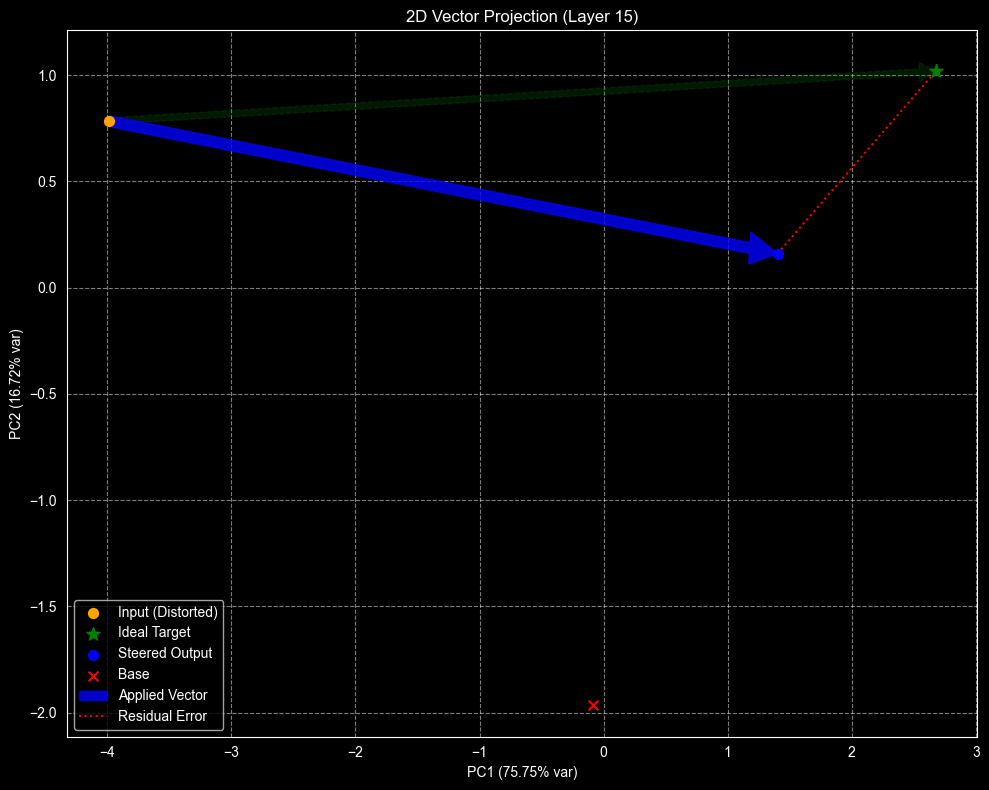

# Iterative Sparse Matrix Steering: Closed-Form Subspace Alignment

  
   
  <em>Figure: Visualizing the "Forbidden Manifold" alignment in 2D space.</em>

---

## 📚 Select Language / Оберіть мову

Please select your preferred language to read the full paper and methodology:
(Оберіть мову, щоб прочитати повну статтю та опис методології):

| 🇬🇧 English | 🇺🇦 Українська |
| :---: | :---: |
| [**Read Full Paper**](./Iterative_Matrix_Steering_EN.md) | [**Читати статтю**](./Iterative_Matrix_Steering_UA.md) |

---

## 🚀 Quick Start

Jump directly to the code implementation and experiments (Gemma3-1B):

### [➡️ Open Jupyter Notebook](./vector/deep_steering_vector.ipynb)

> **Note:** The notebook includes the full pipeline:
> 1. Data extraction
> 2. Ridge Regression training (Closed-Form)
> 3. Inference with `MatrixSteeringHook`
> 4. Visualization of the "Distillation Regime"

---

## ⚡ Key Features
* **No Gradient Descent:** Solves steering matrices analytically using Ridge Regression on CPU.
* **Context-Aware:** Unlike static vectors, matrix steering acts as an affine transformation ($h' = hW^T + b$), adapting to the token's context.
* **Ontological Editing:** Demonstrates how to robustly change model beliefs (e.g., "Moon is Cheese") using high-regularization distillation.